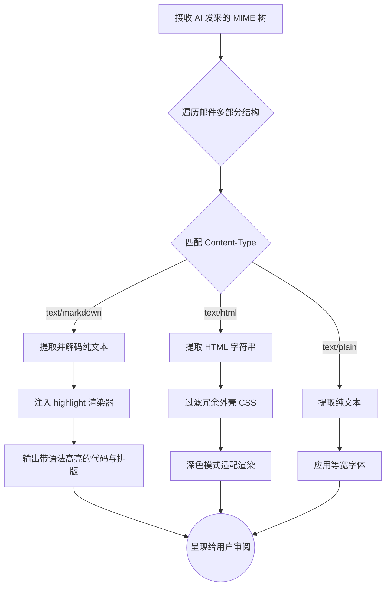

# 📦 墨匣 MarkBox

**"发送是 AI 的脏活累活，阅读是人的高光时刻。"**

一个极简、纯粹的只读邮件客户端，专为 AI Agent 与自动化工作流的通知解析而生。

<p align="center">
  
  
  
  
</p>

---

## 💡 为什么需要墨匣？

当 OpenClaw、n8n 或自建的 AI Agent 开始通过邮件向你汇报工作、发送警报时，传统邮件客户端成了最大的体验瓶颈：

- **审美降级**：AI 精心生成的 Markdown 报告、代码片段，在普通邮箱里被压扁成丑陋的纯文本或残缺的 HTML。
- **图表乱码**：AI 用 Mermaid 画的排障流程图，在你的手机里变成了一堆无法阅读的伪代码。
- **交互错位**：传统邮箱一半的 UI 都在诱导你"回复"、"转发"，但对于机器通知，你只需要**审阅**。

墨匣砍掉了所有"写"的功能，将 100% 的精力投入到**内容的高保真还原**上，让你的手机变成一块纯粹的 AI 监控大屏。

---

## ✨ 核心亮点

- 🤖 **为 AI 通知而生**：深度适配 OpenClaw 等自动化工具发出的复杂格式邮件。
- 🚫 **绝对的只读**：没有写邮件、回复按钮，零干扰的沉浸式阅读。
- ✍️ **原生 Markdown 渲染**：精准提取 `text/markdown`，完美呈现标题、列表与表格。
- 💻 **代码块高亮与复制**：自动识别代码语言并高亮，右上角一键复制，方便直接去终端排错。
- 🔍 **暴力 MIME 拆解**：基于严格优先级 (`MD` -> `HTML` -> `纯文本`) 遍历解析，自动处理 Base64/QP 编码。
- 👁️ **强制提取发件人**：无视通讯录干扰，强制读取邮件头的 `Display Name`。

---

## 🛠️ 技术栈

- **UI 框架**: [Flutter](https://flutter.dev/)
- **状态管理**: [Riverpod](https://riverpod.dev/)
- **邮件协议**: [enough_mail](https://github.com/EnoughSoftware/enough_mail)
- **渲染引擎**:
  - [flutter_markdown](https://pub.dev/packages/flutter_markdown) + [highlight](https://pub.dev/packages/highlight)
  - [flutter_html](https://pub.dev/packages/flutter_html) (兜底)

---

## ⚙️ 它是如何工作的？

当 AI Agent 发送一封复杂的嵌套邮件时，墨匣会在后台进行深度拆解：



---

## 🚀 快速开始

### 前置要求

- Flutter SDK >= 3.x
- Android Studio / VS Code
- 一个支持 IMAP 协议的邮箱（并已开启授权码）

### 本地运行

```bash
# 1. 克隆项目
git clone https://github.com/揉光入野/markbox.git
cd markbox

# 2. 获取依赖
flutter pub get

# 3. 连接设备运行
flutter run
```

---

## 🗺️ 路线图

墨匣的终极形态，是成为 AI Agent 与人类沟通的"最高效视网膜"。

### 🛠️ 当前版本 (v0.1.x) - 夯实基建

- [x] 基础 IMAP 连接与通知流拉取
- [x] 强制提取发件人 Display Name
- [x] 深度 MIME 解析优先级逻辑
- [x] Markdown 基础渲染与 HTML 深色模式适配

### 🎨 下一个版本 (v0.2.x) - 极致阅读体验

- [ ] **代码块高亮与交互**：集成语法高亮引擎，增加"一键复制"按钮。
- [ ] **图表渲染支持**：识别 Mermaid 语法，通过轻量 WebView 渲染为可视化流程图。
- [ ] **Agent 身份视觉区分**：智能识别机器发件地址，列表中使用专属"机器人图标"。

### 🚀 未来探索 (v1.0.x) - 从"阅读器"到"决策面板"

- [ ] **指令回复**：解析 AI 邮件底部的特定标签（如 `Options: [Approve] [Reject]`），将其渲染为 UI 按钮。点击后墨匣自动回复指令给 AI，完成人机闭环。
- [ ] **内容智能降噪**：对冗长的 AI 运行日志自动折叠非报错部分，视线强制聚焦于 `Error`。
- [ ] **多聚合收件箱**：同时拉取多个 Agent 邮箱，按项目或严重程度智能分组。

---

## 🤝 参与贡献

特别是以下方面，非常欢迎你的 PR：

1. **边界情况修复**：遇到奇葩格式邮件导致崩溃？请提交 Issue 并附带脱敏的 `.eml` 文件。
2. **渲染样式美化**：为墨匣定制更符合"终端/极客"气质的深色代码高亮主题。
3. **Mermaid 解析**：如果你有在 Flutter 局部渲染 Mermaid 的好方案，强烈期待你的加入！

---

## 📜 开源协议

基于 [MIT License](LICENSE) 开源，自由使用，后果自负。

---

<p align="center">
  Made with ❤️ by <a href="https://github.com/揉光入野">揉光入野</a>
  <br/>
  <i>Send by AI, Read by Human.</i>
</p>
